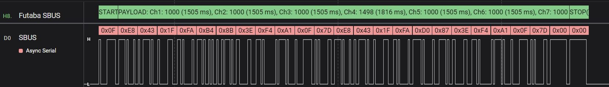
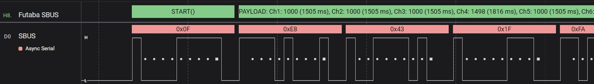

# SBUS-HLA
  
Saleae Logic 2 High Level Analyzer : Futaba SBUS protocol analyzer
  
## Getting started
1. Install the SBUS analyzer in Logic 2 from the extensions menu.
2. Create a new Async Serial analyzer, set the baud rate to 100000 bauds, 8 bits, 2 stop bits, even parity, LSB, inverted.
3. Create a new Futaba SBUS analyzer, configure it and pick the previously created Async Serial analyzer.
  

